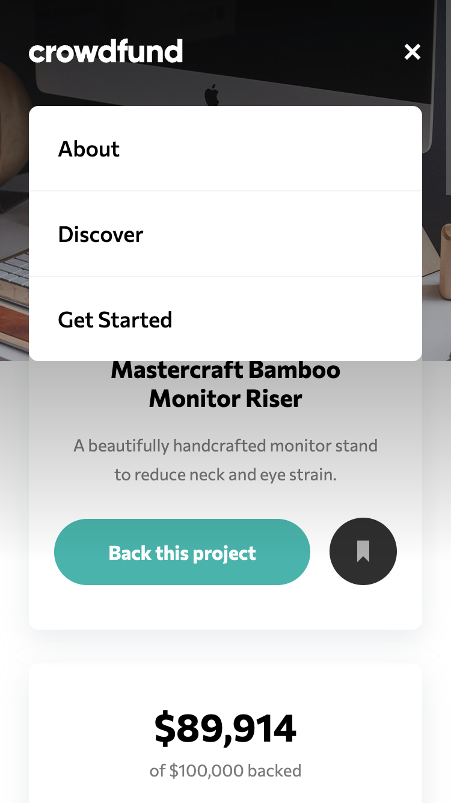

# Frontend Mentor - Crowdfunding product page

I coded this Crowdfunding page myself and the idea and design of the page came from Frontend Mentor. Frontend Mentor provides challenges for frontend developers so they can make projects without the problem of designing the project. [See the challenge on Frontend Mentor.](https://www.frontendmentor.io/challenges/crowdfunding-product-page-7uvcZe7ZR/hub)

## The challenge

The challenge was to create a crowdfunding product page that looks as close as possible to the design screenshots they had given. The page should be watched on a wide range of different screen sizes. The hover states should work as seen in the screenshots. The visitors could place a pledge and after that the backed amount, progress bar and the total backers should be updated. The bookmark button should be working too. As an extra item I made the countdown of the days work.

## Screenshots

  

## My experience

I learned a lot from this project. I tried the BEM naming convention out for css. The functions for opening en closing the different pop up menu's were a bit of a challenge. Writing them was not a problem but the way I wrote them was with a lot of repeated code. Afterwards I needed to change something in the code. That made it hard to change it. I will do that different in the future. 

### Links

-   Solution URL: [github repository](https://github.com/Jolijn0101/crowdfunding-product-page)
-   Live Site URL: [github page](https://jolijn0101.github.io/crowdfunding-product-page/)
